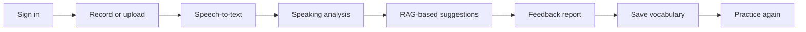
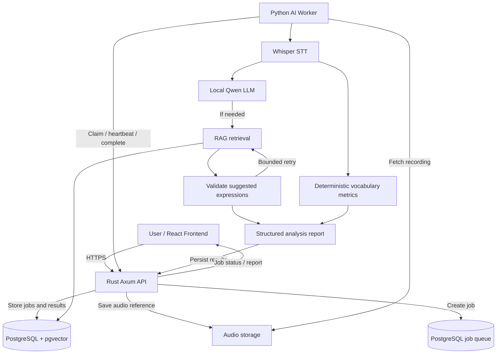

<div align="center">

# EigoSiro 🎙️

### I hate English. But I want to speak it better.

**영어는 싫지만, 잘하고 싶어.**

영어 발화를 분석하고 개인별 학습 피드백을 제공하는 AI 영어 회화 코치

`42 ft_transcendence` · `Rust` · `React` · `Local LLM` · `RAG` · `Agentic Workflow`

> 🚧 **프로젝트 상태: 기획 / 초기 개발**  
> 아래 기능과 아키텍처는 현재 계획안이며 개발 과정에서 변경될 수 있습니다.

</div>

---

## 📌 프로젝트 소개

**EigoSiro**는 영어를 잘하고 싶지만 기존 영어 공부 방식에 부담을 느끼는 사용자를 위한 AI 기반 영어 회화 분석 서비스입니다.

사용자가 영어로 말한 내용을 녹음하거나 업로드하면 음성을 텍스트로 전사하고, 문법·어휘 다양성·반복 표현·문맥 적절성을 분석합니다. 이후 RAG와 제한된 Agentic Workflow를 활용해 사용자가 다음 대화에서 사용할 수 있는 표현과 예문을 추천합니다.

**프로젝트 목표:** 단순한 오류 교정을 넘어 **말하기 → 분석 → 학습 → 다시 말하기**로 이어지는 개인화 학습 경험을 제공합니다.

## ✨ 주요 기능 (예정)

| 기능 | 설명 | 상태 |
| --- | --- | --- |
| 음성 녹음 및 업로드 | 브라우저에서 영어 발화를 녹음하거나 파일 업로드 | 📋 예정 |
| 음성 전사 (STT) | Whisper를 이용해 음성을 영어 텍스트로 변환 | 📋 예정 |
| 영어 발화 분석 | 문법 오류, 반복 어휘, 표현 및 문맥 적절성 분석 | 📋 예정 |
| 어휘 다양성 지표 | 단어 빈도, MATTR 등 재현 가능한 정량 지표 계산 | 📋 예정 |
| RAG 기반 표현 추천 | 문맥·예문·학습 수준을 고려한 대체 표현 검색 | 📋 예정 |
| Agent 기반 피드백 | 추천 결과를 검증하고 필요한 경우 제한적으로 재검색 | 📋 예정 |
| 개인 단어장 | 추천 단어와 표현을 저장하고 복습 | 📋 예정 |
| 학습 이력 분석 | 시간에 따른 변화 확인 및 이전 추천 표현 재학습 | 💡 추가 목표 |

> AI 피드백은 학습을 돕기 위한 참고 정보이며 공인 영어 능력 평가 점수가 아닙니다. 문법 판정과 표현 추천은 별도 평가 데이터셋으로 검증할 예정입니다.

## 👤 사용자 흐름

1. **로그인** 후 영어 말하기 연습 페이지에 접속합니다.
2. 영어 발화를 **녹음하거나 업로드**합니다.
3. 녹음을 **제출**하고 분석 진행 상태를 확인합니다.
4. **전사된 문장과 분석 리포트**를 확인합니다.
5. 추천 표현의 **뜻·예문·사용 맥락**을 확인합니다.
6. 필요한 표현을 **개인 단어장에 저장**합니다.
7. 다시 연습하고, 추후 **학습 이력의 변화**를 확인합니다.



## 🏗️ 시스템 아키텍처 (계획)



### 아키텍처 설계 의도

- **Rust API:** 사용자 요청, 인증, 분석 작업 및 결과 저장을 담당합니다.
- **Python AI Worker:** STT, 로컬 LLM 추론, RAG 검색 및 피드백 생성을 담당합니다.
- **PostgreSQL + pgvector:** 관계형 사용자 데이터와 벡터 검색을 하나의 DB에서 처리합니다.
- **비동기 작업 처리:** CPU 기반 추론 중에도 HTTP 요청이 장시간 대기하지 않도록 구성합니다.
- **재시도 횟수 제한:** Agent의 무한 반복과 과도한 추론 자원 사용을 방지합니다.

## 🧠 AI 및 RAG 설계

### 분석 파이프라인

1. Whisper가 사용자의 녹음 파일을 텍스트로 전사합니다.
2. 일반 알고리즘으로 단어 빈도와 어휘 다양성 지표를 계산합니다.
3. 로컬 LLM이 문법·문맥을 분석하고 개선할 표현을 찾습니다.
4. RAG가 사전에 구축된 영어 표현 데이터에서 관련 예문과 대체 표현을 검색합니다.
5. LLM이 추천 표현이 원문의 의미와 문맥을 유지하는지 검증합니다.
6. 결과를 구조화된 리포트로 저장합니다. 부적절한 추천은 제외하거나 정해진 횟수 내에서 재검색합니다.

**RAG 데이터 필드 (예정):** 표현, 의미, 사용 상황, 예문, 주제, 검증된 CEFR 수준, 임베딩 벡터

**설계 원칙:** RAG는 소형 모델에 관련 근거를 제공하지만, 모델 자체의 추론 능력이나 문법 분석의 정확성을 보장하지는 않습니다. 이를 확인하기 위해 **RAG 적용 전후의 결과 품질을 비교 평가**할 예정입니다.

## 🛠️ 예상 기술 스택

| 영역 | 기술 | 용도 |
| --- | --- | --- |
| Frontend | React, TypeScript, Vite | 녹음 및 분석 결과 UI |
| Backend | Rust, Axum, Tokio | HTTP API와 비동기 작업 관리 |
| AI Worker | Python | AI 분석 파이프라인 및 작업 제어 |
| Speech-to-Text | whisper.cpp / Whisper | 로컬 영어 음성 전사 |
| LLM | Qwen3 1.7B 또는 4B, llama.cpp / Ollama | 로컬 언어 분석 |
| Embedding | 경량 영어 임베딩 모델 | 문맥 기반 의미 검색 |
| Database | PostgreSQL + pgvector | 서비스 데이터 및 벡터 검색 |
| Reverse Proxy | Caddy | HTTPS 및 요청 라우팅 |
| Deployment | Docker Compose, ARM64 호환 이미지 | 컨테이너 기반 배포 |
| CI/CD | GitHub Actions | 빌드·검증·배포 자동화 |
| Hosting | Oracle Cloud ARM (후보) | 저비용 CPU 기반 운영 |

> **모델은 미확정입니다.** 개발 장비와 실제 배포 환경에서 Qwen3 1.7B와 4B의 분석 품질, 지연시간, 메모리 사용량을 비교한 뒤 선택합니다. Whisper와 임베딩 모델도 같은 방식으로 결정할 예정입니다.

## 👥 팀 역할 분담 (4인 기준)

| 역할 | 주요 담당 업무 | 산출물 |
| --- | --- | --- |
| **Frontend & UX** | 녹음·업로드 UI, 진행 상태, 분석 리포트, 개인 단어장, 접근성 | 반응형 웹 애플리케이션 및 UI 테스트 |
| **Rust Backend & Data** | 인증, REST API, DB 스키마, 작업 할당·lease·재시도, 권한 검증 | API 서버, DB 마이그레이션, 통합 테스트 |
| **AI & RAG** | STT, 어휘 지표, LLM 프롬프트, 검색, 피드백 품질 평가 | 재현 가능한 AI 파이프라인 및 평가 데이터셋 |
| **Infrastructure & Integration** | Docker Compose, ARM64 빌드, CI/CD, 시크릿, HTTPS, 모니터링, E2E 통합 | 배포 환경 및 운영 문서 |

**5인 팀으로 확장하는 경우:** Infrastructure & Integration 역할을 **Platform / DevOps**와 **Quality & Integration**으로 분리합니다. 추가 팀원은 E2E 자동화, 평가 데이터 기반 품질 검증, 부하 테스트 및 릴리스 검증을 담당할 수 있습니다.

API 계약, 코드 리뷰, 아키텍처 결정, 42 과제 필수 모듈 구현은 팀 전원이 협업합니다. 실제 모듈 선택은 적용되는 ft_transcendence 명세 버전을 확인한 뒤 확정합니다.

## 🗓️ 개발 로드맵

- [ ] **Phase 1 — AI 가능성 검증:** STT를 실행하고 영어 발화 샘플로 소형 LLM별 분석 결과를 비교합니다.
- [ ] **Phase 2 — RAG 구축:** 영어 표현 데이터, 임베딩, 벡터 검색을 구현하고 추천 적합성을 평가합니다.
- [ ] **Phase 3 — Agent Workflow:** 분석·검색·검증·제한적 재검색을 연결합니다.
- [ ] **Phase 4 — 웹 서비스 개발:** Rust API, 작업 큐, 인증, 녹음 UI 및 리포트를 구현합니다.
- [ ] **Phase 5 — 배포:** 서버 배포, ARM64 호환성 확인, CI/CD, 모니터링을 구성합니다.
- [ ] **Phase 6 — 성능 및 품질 검증:** 피드백 품질, 전체 처리시간, 메모리 사용량, 장애 복구 및 재현성을 평가합니다.

### 주요 평가 항목

- 동일 테스트셋에서 **LLM 단독 / LLM + RAG / LLM + RAG + 검증 단계**의 결과 비교
- 전사 오류, 추천 표현 적절성, JSON 출력 유효성, 전체 처리 지연시간 측정
- 저비용 CPU 서버의 CPU·RAM 사용량 측정
- AI Worker가 비정상 종료되었을 때 분석 작업의 복구 여부 확인

## 🗂️ 예정 레포지토리 구조

```text
.
├── frontend/            # React + TypeScript
├── backend/             # Rust + Axum
├── ai-worker/           # Python, Whisper, LLM, RAG
├── infra/               # Docker Compose, deployment configs
├── docs/                # Architecture, API contracts, ADRs
├── tests/               # Integration and end-to-end tests
└── README.md
```

## ☁️ 배포 전략

**로컬 개발:** MacBook Air M1(16GB)에서 AI 모델을 실험하고, Raspberry Pi 5(8GB)는 선택적으로 서비스 호스팅에 사용합니다.

**클라우드 우선 후보:** 비용을 줄이기 위해 Oracle Cloud ARM CPU 인스턴스를 검토합니다. 양자화된 소형 LLM과 경량 STT는 CPU에서도 실행 가능하지만, 실서비스에 적합한 응답시간과 동시 처리량을 확보할 수 있는지는 검증이 필요합니다.

**대안:** Oracle CPU 환경의 추론 속도가 부족하면 Rust API·DB 서버와 Mac 기반 AI Worker를 분리해 운영합니다.

## 📄 프로젝트 참고 사항

이 저장소는 **42 ft_transcendence** 팀 프로젝트를 위한 것입니다. 기능, 기술 스택, 역할 분담은 실제 적용되는 과제 명세와 개발 진행 상황에 따라 조정될 수 있습니다.

---

<div align="center">

**EigoSiro — Speak. Analyze. Improve. Repeat.**
<!--

**Here are some ideas to get you started:**

🙋‍♀️ A short introduction - what is your organization all about?
🌈 Contribution guidelines - how can the community get involved?
👩‍💻 Useful resources - where can the community find your docs? Is there anything else the community should know?
🍿 Fun facts - what does your team eat for breakfast?
🧙 Remember, you can do mighty things with the power of [Markdown](https://docs.github.com/github/writing-on-github/getting-started-with-writing-and-formatting-on-github/basic-writing-and-formatting-syntax)
-->
